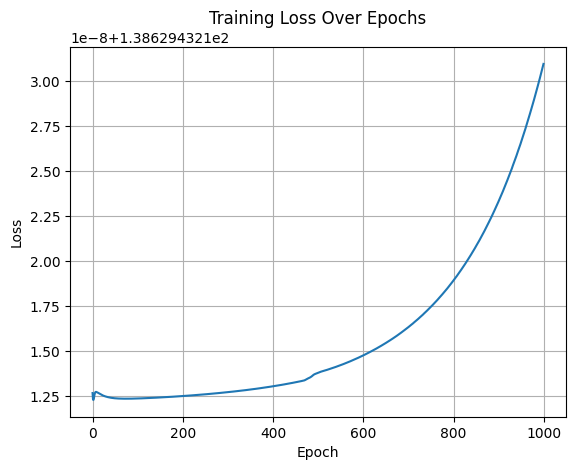
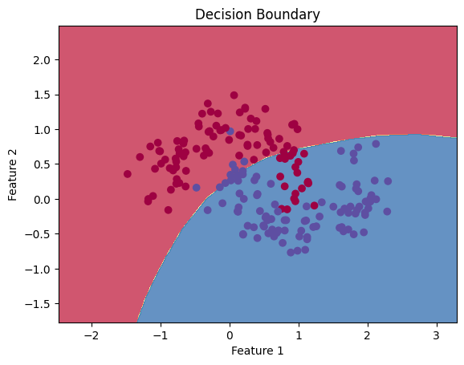

## 🧠 Deep Feedforward Neural Network from Scratch

### 🔍 Overview

This project implements a **Deep Feedforward Neural Network (DFNN)** from scratch using **NumPy**, without relying on high-level libraries like TensorFlow or PyTorch. It is designed for **binary classification** tasks on non-linearly separable datasets such as `make_moons`.

Key features:

* Manual implementation of **forward and backward propagation**
* Custom **activation functions**
* Use of **Binary Cross-Entropy Loss**
* Visualizations of the **training loss** and the **decision boundary**

---

### 📌 Objectives

* Understand the fundamentals of neural networks
* Implement a DFNN manually (forward & backward pass)
* Visualize model performance
* Practice training on synthetic data

---

### 🧰 Technologies Used

* Python
* NumPy
* Matplotlib
* Scikit-learn (for data generation only)

---

### 🧠 Model Architecture

* Input: 2 neurons (2D features)
* Hidden Layers: 2 hidden layers (20 and 10 neurons)
* Output: 1 neuron (binary classification)
* Activations: ReLU for hidden layers, Sigmoid for output

---

### 📉 Training Results

| Metric        | Value            |
| ------------- | ---------------- |
| Epochs        | 1000             |
| Learning Rate | 0.1              |
| Accuracy      | 84.50  |

---

### 📊 Visualizations

#### 📈 Loss Curve



#### 🧭 Decision Boundary



---

### 🚀 How to Run

You can run this notebook in **Google Colab** or **locally in Jupyter**.

1. Clone the repository
2. Open `DeepFeedforwardNN.ipynb`
3. Run all cells
4. Modify `learning_rate`, `epochs`, or architecture to experiment

---

### 📁 Project Structure

```
📦 DeepFeedforwardNN-FromScratch
├── DeepFeedforwardNN.ipynb     # Full implementation
├── README.md
├── assets/
│   ├── loss_curve.png
│   └── decision_boundary.png
```

---

### 🧠 What I Learned

* How feedforward and backpropagation work internally
* Importance of activation functions and gradients
* Tuning hyperparameters like learning rate and epochs
* Visualizing decision boundaries for classification

---

### ✅ To-Do (Optional Extensions)

* [ ] Add train/test split and evaluate test accuracy
* [ ] Add support for multiple output neurons (multi-class)
* [ ] Implement Dropout or L2 Regularization
* [ ] Experiment with `make_circles` or XOR datasets
